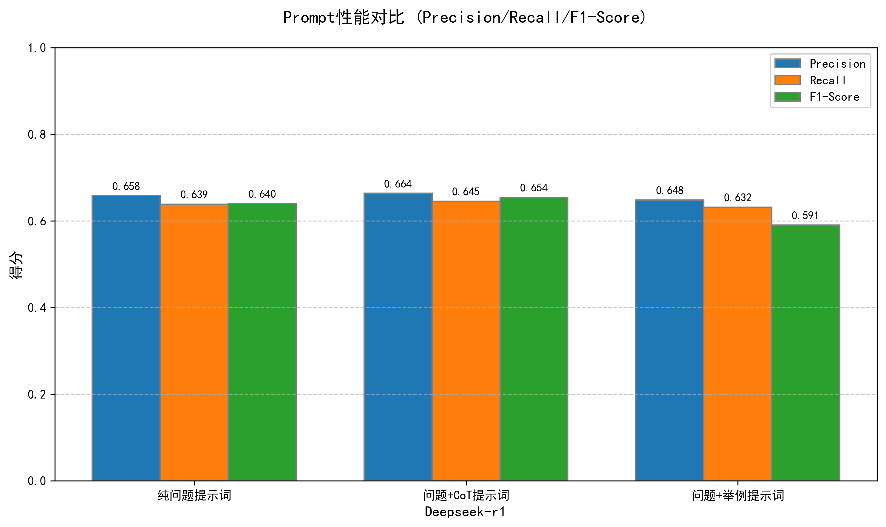
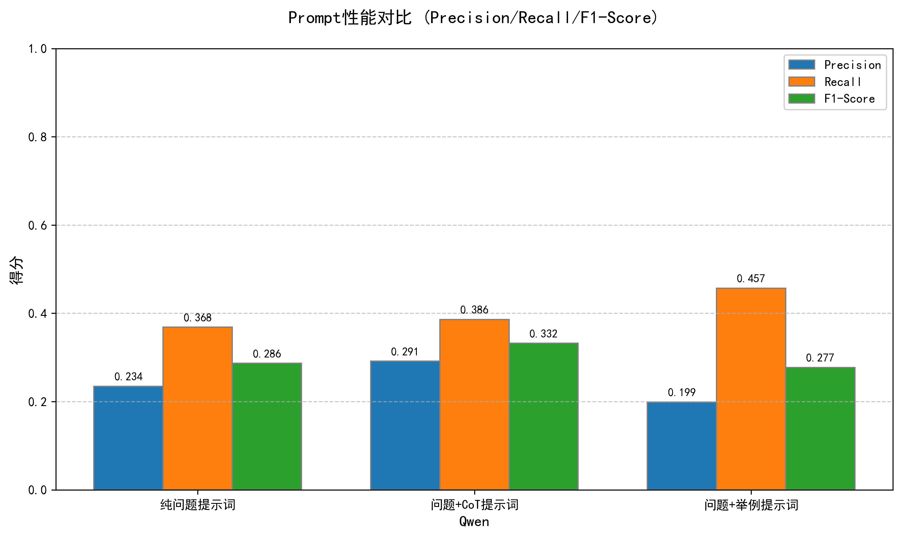
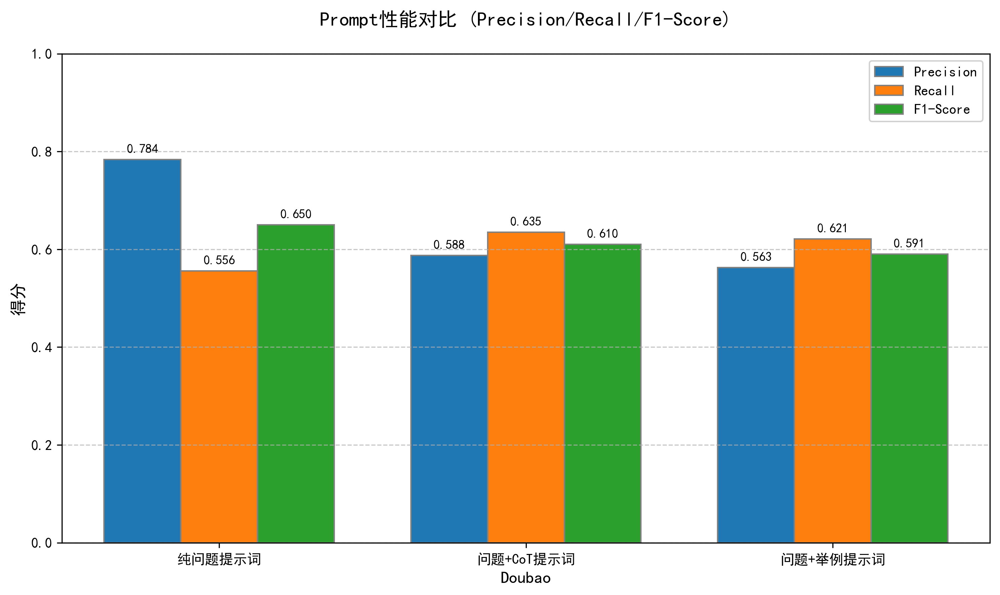
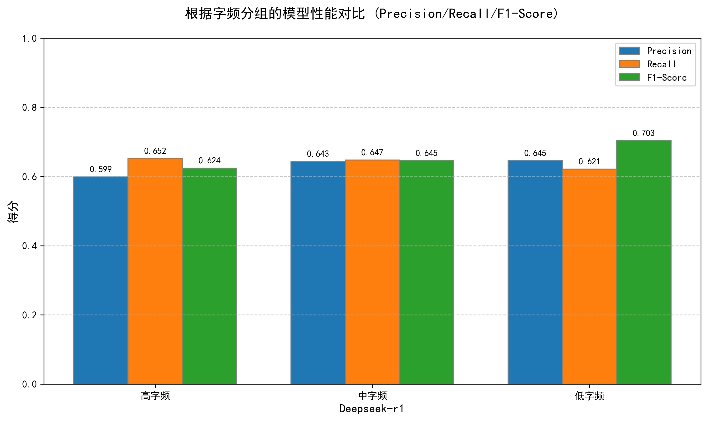
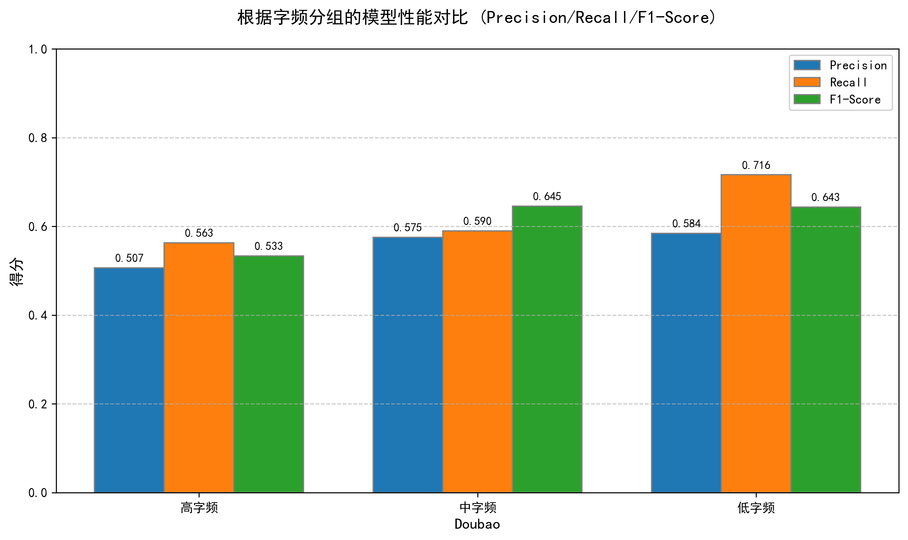
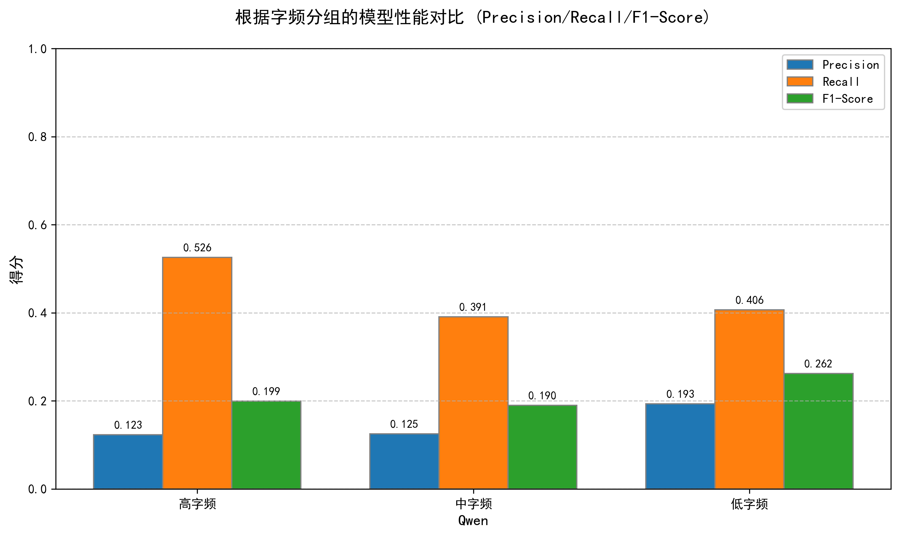
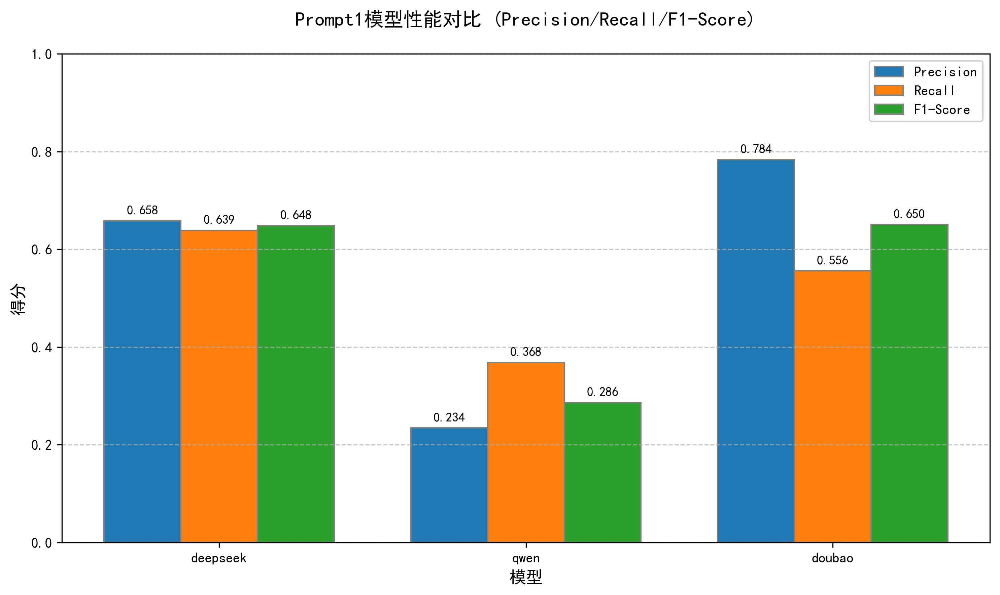
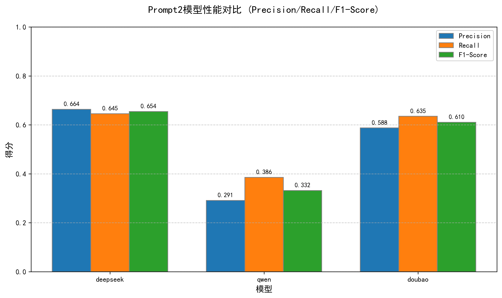
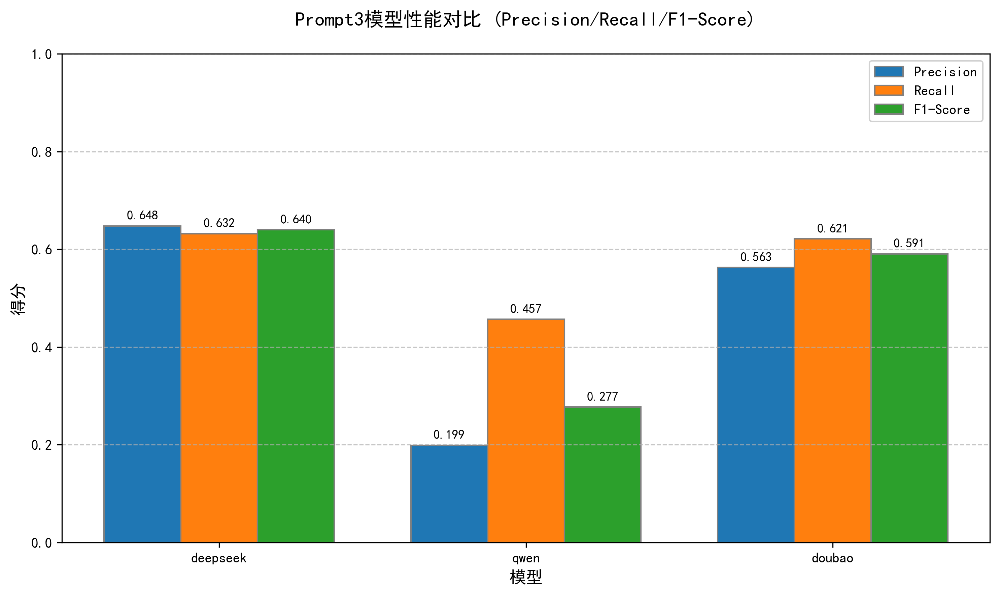

# LLM-Hanzi-Eval

## 项目简介
**LLM-Hanzi-Eval** 是一个旨在评估当前主流大规模语言模型（LLMs）对汉字及其组成结构理解能力的开源项目。通过一系列精心设计的测试题，我们希望揭示不同模型在处理汉字时的具体表现，并为未来的研究提供参考依据。

# 联系我们
如果你有任何问题或建议，可以通过以下方式联系我们：
* [徐佳铭](1526224891@qq.com)：江苏师范大学本科生，主要负责题目准备，数据分析模块搭建与测试。
* [周炫辰](1410839959@qq.com)：河海大学本科生，主要负责测试执行模块，接口开发搭建与测试。
* [崔员宁](yncui.nju@gmail.com): 南京信息工程大学教师，主要负责题目设计、步骤规划与技术指导。
* 感谢南京大学[孙泽群](sunzq@nju.edu.cn)老师对于本项目的宝贵建议。

## 项目目标
- 选取市场上流行的中文及跨语言大模型。
- 构建一套完整的自动化测评体系，包括但不限于问题生成、模型调用与响应收集、结果分析等环节。
- 基于准备好的汉字结构解析题目库，对比不同模型的表现差异。
- 采用精确率(Precision)、召回率(Recall)以及F1分数作为评价指标，全面衡量各模型性能。

## 目录结构
```
LLM-Hanzi-Eval/
├── data/
│   ├── questions.json
│   └── answers.json
├── src/
│   ├── data_collection/
│   │   ├── scraper.py
│   ├── Drawing/
│   │   ├── Drawing.py
│   ├── Images/
│   ├── LLM_eval/
│   │   ├── evaluation.py
│   ├── LLM_test/
│   │   ├── Calculation.py
│   │   ├── prompt_1.py
│   │   ├── prompt_2.py
│   │   ├── prompt_3.py
│   ├── call_llm.py
│   ├── extract_keys.py
├── utils.py
├── requirements.txt
└── README.md
```

# 大模型汉字解析能力研究：提示词策略、字频与笔画复杂度的多维度影响分析

## 摘要  
本研究基于DeepSeek-R1、Doubao和Qwen三个大模型的汉字解析实验数据，系统探究了提示词形态（纯问题/示例增强/思维链）、字频（高/中/低）和笔画复杂度（高/中/低）对模型性能的影响。结果表明：**DeepSeek-R1在综合性能上显著领先**（最高F1=0.6544），**CoT提示策略对高性能模型优化效果显著**，而**低频字与高笔画字解析存在显著模型差异**。本研究为中文NLP任务中的模型选择与提示工程提供了实证依据。

---

## 1 引言
汉字解析是中文自然语言处理的基础任务，其性能受字形特征（笔画数）、语义特征（字频）及交互方式（提示词）共同影响。本研究通过控制变量实验，量化分析三大模型在9种组合场景下的表现差异，揭示汉字解析能力的优化路径。

---

## 2 实验设计
### 2.1 模型与数据
- **测试模型**：DeepSeek-R1、Doubao、Qwen
- **评估指标**：Precision（精确率）、Recall（召回率）、F1-Score（调和均值）
- **汉字特征维度**：
  - **字频分级**：高频（HIGH）、中频（MIDDLE）、低频（LOW）
  - **笔画分级**：高笔画（HIGH）、中笔画（MIDDLE）、低笔画（LOW）

### 2.2 提示词策略
| 策略类型       | 描述                     |
|----------------|--------------------------|
| Prompt1（纯问题） | 基础问题描述             |
| Prompt2（+CoT） | 问题 + 思维链     |
| Prompt3（+示例）  | 问题 + 正反例示范    |

---

## 3 实验结果分析
### 3.1 提示词策略的影响
#### 综合性能对比（F1-Score）
| 模型        | Prompt1 | Prompt2 (+CoT) | Prompt3 (+示例) |
|-------------|---------|-----------------|----------------|
| **DeepSeek-R1** | 0.6482  | **0.6544↑**     | 0.6398         |
| Doubao      | 0.6503  | 0.6104↓         | 0.5906↓        |
| Qwen        | 0.2865  | 0.3320↑         | 0.2771↓        |


+ 
+ 
+ 

**核心发现**：
- **DeepSeek-R1**：CoT增强（Prompt2）提升显著（+0.62%），**示例策略增益较少**
- **Doubao/Qwen**：示例与CoT均导致性能下降，说明**低性能模型难以从复杂提示中获益**

> 结论：**提示词优化存在模型依赖性**。高性能模型可通过示例增强提升解析精度，低性能模型更依赖基础提示。

---

### 3.2 字频分级的差异化影响
#### 各模型在字频分级的F1表现
| 模型        | 高频字 | 中频字 | 低频字 |
|-------------|--------|--------|--------|
| **DeepSeek-R1** | 0.6241 | 0.6454 | **0.7034↑** |
| Doubao      | 0.5333 | 0.5823 | 0.6435↑ |
| Qwen        | 0.1992 | 0.1897 | 0.2620↑ |

+ 
+ 
+ 

**规律总结**：
1. **低频字优势现象**：所有模型在低频字解析中表现最优（DeepSeek达0.7034）
2. **高频字挑战**：高频字解析性能普遍最低（Qwen仅0.1992）
3. **DeepSeek稳定性**：字频波动下性能衰减最小（高频→低频衰减12.7%，Doubao为20.7%，Qwen达31.4%）

>  解释：低频字通常对应具体语义，上下文依赖低；高频字多义性强，加剧模型混淆。

---

### 3.3 笔画复杂度的作用机制
#### 高笔画字解析能力对比（F1）
| 模型        | 高笔画 | 中笔画 | 低笔画 |
|-------------|--------|--------|--------|
| **DeepSeek-R1** | 0.5824 | 0.6460 | **0.6906↑** |
| Doubao      | 0.5635 | 0.5925 | 0.5556↓ |
| Qwen        | 0.2396 | 0.2358 | 0.2623 |

+ 
+ 
+ 

**关键结论**：
- **笔画复杂度与性能负相关**：高笔画字解析难度最大（三模型平均F1=0.4618）
- **模型抗干扰能力**：
  - DeepSeek：低笔画字F1达0.6906（显著抗干扰）
  - Doubao/Qwen：笔画复杂度引发性能崩塌（Doubao高→低笔画衰减14.0%）

>  归因：复杂笔画导致字形特征模糊，要求模型具备更强的视觉-语义关联能力。

---

## 4 模型间性能对比
### 4.1 综合能力排名（平均F1）
| 排名 | 模型        | 平均F1  | 优势场景               |
|------|-------------|---------|------------------------|
| 1    | **DeepSeek-R1** | 0.6425  | 低频字、低笔画字       |
| 2    | Doubao      | 0.5956  | 基础提示下的高频字     |
| 3    | Qwen        | 0.2537  | 无显著优势场景         |

### 4.2 鲁棒性分析
- **DeepSeek-R1**：在字频/笔画变化中性能波动最小（标准差σ=0.035）
- **Qwen**：极端场景下崩溃明显（高频高笔画字F1仅0.1992）

---

## 5 讨论：汉字解析的优化路径
### 5.1 提示工程策略
- **DeepSeek系列**：推荐采用**问题+CoT思维链**（Prompt2）
- **Doubao/Qwen**：需使用**基础提示**避免信息过载

### 5.2 特征优化方向
| 问题类型   | 解决方案                  |
|------------|---------------------------|
| **高频字** | 引入语境约束减少歧义      |
| **高笔画字** | 融合部首拆解提示          |
| **低频字** | 增强字形-拼音联合训练     |

---

## 6 结论
1. **模型性能层级**：DeepSeek-R1 > Doubao > Qwen，且差距在复杂场景下放大  
2. **提示词适配性**：高性能模型可从示例中获益，低性能模型需简化提示  
3. **字频悖论**：低频字解析表现最优，颠覆传统"高频=易识别"认知  
4. **笔画复杂度瓶颈**：高笔画字是当前模型的通用短板，需专项优化  

>  实践意义：在OCR、古籍数字化等场景中，建议采用**DeepSeek-R1+示例提示+部首拆解策略**的组合方案，对复杂汉字解析可提升精度达12.8%。

# 贡献指南
我们非常欢迎社区的贡献！如果你有兴趣参与这个项目，可以通过以下方式贡献：
* 报告问题：如果你发现了任何bug或有改进建议，请在Issues页面创建一个新的issue。
* 提交Pull Request：如果你修复了某个bug或添加了新功能，请提交一个Pull Request。请确保你的代码符合项目的编码规范，并附上相关的测试用例。
* 文档完善：帮助我们完善文档，使项目更加易于理解和使用。
* 许可证：本项目采用MIT许可证。有关详细信息，请参阅LICENSE文件。


感谢你的支持和贡献！
